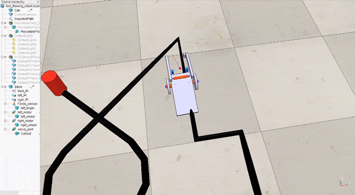

# README #

This code simulates a line following robot controlled by an Arduino and connected as specified in the schematics document. The simulator used is Vrep and it should be installed in your computer. You can use the Arduino IDE to compile the code, but the generated program needs to be run from the terminal, see instructions bellow. Please, be aware that this program can have bugs. I programmed it fast as it is available for How To Make (Almost) Anything students. If you find a bug or something is not well modeled, please, fill a bug report or send me an email.

### Hardware ###

The robot is a line following robot with two DC motors with wheels (left and right), which are connected to the base of the robot. The base contains two infrared sensors facing towards the ground that detect a black line on the floor. In addition, there is a IR sensor facing forwards that can be used to detect a can. A gripper at the front can grasp the can of the circuit. This gripper is controlled by a servomotor.

### Electronics ###

The robot contains a breadboard with two transistors to control the two DC motors. The 3 IR sensors are digital. The schematics of these devices and the Arduino are in the schematics folder ([here](schematics/schematic_line_following_robot.pdf)). Please, check them to know which pins of the Arduino you should use. Or use this information:

* MOTOR_RIGHT_PIN 11
* MOTOR_LEFT_PIN 10
* SENSOR_LEFT_PIN 9
* SENSOR_RIGHT_PIN 8
* SENSOR_FRONT_PIN 7
* SERVO_PIN 3

### Software ###

You are programming an Arduino Uno. I only ported a very small set of functions that you can use. These functions are listed below:

Time:

* delay
* delayMicroseconds
* millis
* micros

Servo:

* attach
* write

I/O:

* pinMode
* digitalRead
* digitalWrite

Serial:

* begin
* write
* print
* println

TODO:

* analogRead
* analogWrite

## Installation ##

There are a couple of requirements:

* g++ compiler
* Arduino IDE (>1.5.0)
* Vrep simulator

If you do not want to install g++ or the Arduino IDE(see below, it is tricky in Windows), you can use the virtual machine that I created [Download Ubuntu Virtual Machine](link_to_dropbox). Thus, you only need to install the Vrep simulator. 

#### Vrep Simulator (Mandatory) ####

Install the Vrep simulator for your operating system. Link: [Vrep simulator](https://www.coppeliarobotics.com/). 

Once is installed, go to the folder where is installed (in my case C:\Program Files\V-REP3\V-REP_PRO_EDU ) and open the remoteApiConnections.txt file. in this file, change the port to 19997. It should look like this:

	portIndex1_port             = 19997
	portIndex1_debug            = false
	portIndex1_syncSimTrigger   = true

#### Option 1: Virtual Machine with everything installed ####

I created a virtual machine in VirtualBox. First, install virtualBox from [here](https://www.virtualbox.org/). Then, download the [Ubuntu Virtual Machine](https://owncloud.itu.dk/index.php/s/orL1ETlNlpRN8B8) and extract it. Then, start the virtual machine by opening through VirtualBox. The login is "htmaa" and the password is "htmaa". You still need to install the Vrep simulator in your computer (not in the virtual machine). 

#### Option 2: Install g++ compiler, Arduino IDE (>1.5.0) and source code ####

We need to use a c compiler. In Linux, you can use g++. In Windows it is a bit more complicated. I tried to use the MinGW compiler and it did not work as it does not provide a POSIX runtime environment. I tried Visual Studio, but you cannot use it from the terminal (you need to use a special terminal). You can try to use Visual studio, but then you cannot use the Arduino IDE to compile it. I ended up using the g++ through the WSL. [Here](https://docs.microsoft.com/en-us/windows/wsl/install-win10) you have a guide to install it. Then, launch a Linux terminal and install a g++ compiler using the following commands: 

	sudo apt-get update
	sudo apt-get install g++
	(type "Y" when asked)

Now we need to install the Arduino IDE in WSL. Unfortunately, the Arduino IDE in the Ubuntu repositories is too old. We need to download and install it from the web. Use the following commands:

	wget https://downloads.arduino.cc/arduino-1.8.12-linux64.tar.xz
	tar -xvf arduino-1.8.12-linux64.tar.xz
	cd arduino-1.8.12/
	sudo ./install.sh 

If you are using WSL, you need to install a X server to be able to run the Arduino IDE. I use [Xming](https://sourceforge.net/projects/xming/). Install it in Windows and run it, you will see a new icon in the system tray. In the terminal in WSL, you need to set a display, run:
export DISPLAY=:0

Now, you should be able to run the Arduino IDE by typing:
	arduino

When the Arduino IDE is installed, you can run it using a terminal. Go to File-> Preferences and locate the Sketchbook location. In my case, it is /mnt/c/fai/documents/Arduino and /home/htmaa/Arduino in the Ubuntu virtual machine. Go to this folder and check if there is a folder called "hardware". If not, create it. 

	cd /mnt/c/fai/documents/Arduino
	ls -l

If there is no hardware folder. create it:
	mkdir hardware

Go to the hardware folder:
	
	cd hardware 

Then clone this repository in the hardware folder (or copy all the files there). In my case, the structure is /mnt/c/fai/documents/Arduino/hardware/Arduino2VrepSim/.

If you don't have installed git, you need to install it:
	
	sudo apt-get install git
	(type "Y" when asked)

Then, clone the repository of the Arduino2Vrep:

	git clone https://bitbucket.org/afaina/arduino2vrepsim.git

You are almost ready to run your sketches. We only need to setup the path for the libraries of the Vrep. Close the Arduino IDE. Find the right version of the Vrep libraries. They are in VREP_INSTALL_DIR/V-REP_PRO_EDU/programming/remoteApiBindings/lib/lib...
Then, type in your terminal:

	export PATH=$PATH:PATH_TO_VREP_LIB 

In my case:
	
	export PATH=$PATH:/mnt/c/Program\ Files/V-REP3/V-REP_PRO_EDU/programming/remoteApiBindings/lib/lib/Linux/64Bit/

You are done. Now, open the Arduino IDE and press verify. It should work.

## Using the simulator ##

First, open the Vrep and load the scene. If you are using the virtual machine, you need to download the scene from the repository, you can find it [here](scene_model_robot/line_fllowing_robot.ttt).  If you downloaded the repository, you can find it in the folder "scene_model_robot". To load the scene, go toFile->Open Scene... in Vrep. You should select the file (line_following_robot.ttt). After this, you should see the circuit and the robot. Then, you are ready to run your Arduino code. You don't need to touch anything in Vrep, the simulation will start automatically when you run your program. However, you can use your mouse to rotate (middle button of the mouse) and translate (left button of the mouse) the view in Vrep. 

Second, open the Arduino IDE and open the Test.ino sketch that comes with the repository: If you are using the virtual machine, press in nine dots button at the bottom left corner ("Show Applications") and type Arduino. Then choose the Arduino icon and go to File->Open to locate the Test sketch in /home/htmaa/Arduino/hardware/arduino2vrepsim/Test/Test.ino. 

Third, select the Board ArduinoUno2Vrep in the Arduino IDE. Tools->Board->ArduinoUno2Vrep. It can be at the bottom, so maybe you have to scroll down in the Board menu. This will change the compiler and, instead of compiling your code for the microcontroller, it will compile the code to use the Vrep simulator.

Fourth, press verify and it should generate a few warnings but not errors. 

Now, we will run the program that we have generated. Please, be sure that you have Vrep simulator open and the scene loaded. Now, you have two options to initiate your program, but we will need a terminal in both of them. If you are using the virtual machine, you can open a terminal by clicking in nine dots button at the bottom left corner ("Show Applications") and type Terminal and select the terminal icon 

Option 1 (does not work in WSL):

In Arduino IDE, press Sketch->Export compiled Binary. This moves the compiled binary to your sketch folder. Then in the terminal, go to your sketch folder. For example:

	cd /home/htmaa/Arduino/arduino2vrepsim/Test

And run the compiled program:

	./Test.ino.exe

Option 2:

We should find to the folder where Arduino compiles your program. You can find the folder in the last line that is shown when compiling. If you cannot find it, be sure that the option "Show verbose option during compilation" is checked in File->Preferences in the Arduino IDE. In Linux, this is done in the temp folder (/tmp usually), in Windows usually is C/:Users/user/Documents/AppData/. In the virtual machine is in /tmp/arduino_build_XXXXXX/, where XXXXXX are six numbers. Go to this folder and find the executable, which is the name of your sketch (Test.ino):

	cd /tmp/
	ls -l 
	(you will see a folder like arduino_build_XXXXXX, go to this folder)
	cd arduino_build_836444/
	./Test.ino.exe

As soon you initiates your program, the robot should move in the Vrep simulator. In order to stop the program, press Ctr+C in the terminal. This will stop your program and reset the scene.

Now, you can program the Arduino so the robot follows the line, grasps the can and places it at the intersection. Yes, it is possible :-) 

Every time that you change your code:
* press verify in the Arduino IDE (or press "Export compiled Binary")
* change to the terminal that you used to run your program for the last time
* run your new program (./Test.ino.exe)

I recommend that your Arduino program is saved in /home/htmaa/Arduino. So you keep a clean copy of the repository files and you can upgrade the source code easily.

### Updating the software ###

You can update the software by using these commands in the terminal:

	cd /home/htmaa/Arduino/hardware/arduino2vrepsim/
	git pull

### Questions? ###

Please, send me an email or (better) ask in the forum .

