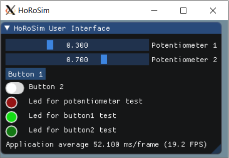

# Examples #

## Line Following Robot ##

This example shows the basic functions of the simulator. It simulates  
a line following robot controlled by an Arduino and connected as specified in the schematics document, see examples/lineFollowingRobot folder. 

### Hardware ###

The robot is a line following robot with two DC motors with wheels (left and right), which are connected to the base of the robot. The base contains two infrared sensors facing towards the ground that detect a black line on the floor. In addition, there is a IR sensor facing forwards that can be used to detect a can. A gripper at the front can grasp the can of the circuit. This gripper is controlled by a servomotor.

### Electronics ###

The robot contains a breadboard with two transistors to control the two DC motors. The 3 IR sensors are digital. The schematics of these devices and the Arduino are in the schematics folder ([here](..examples/lineFollowingRobot/schematics/schematic_line_following_robot.pdf)). Please, check them to know which pins of the Arduino you should use. Or use this information:

* MOTOR_RIGHT_PIN 11
* MOTOR_LEFT_PIN 10
* SENSOR_LEFT_PIN 9
* SENSOR_RIGHT_PIN 8
* SENSOR_FRONT_PIN 7
* SERVO_PIN 3

## User Interface ##

This example shows the basic functions of the user interface, see examples/userInterface folder. It simulates two potentiometers, two buttons (one momnetary push button and a latching toggle button) and a red led. This example does not need a CoppeliaSim model as there are no motors or sensors (apart from the sensors of the user interface).
The potentiometer 2 controls the intensity of the Led and prints the status of the two buttons through serial communications, see the code of the arduino sketch. 

## PID Controller ##

This example shows a PID controller in action. The scene consists of a big disc that is static (not affected by the physics engine) with a graduated scale where a DC motor (red joint) controls a dial (dynamic body). The DC motor is controlled by an H-bridge and, therefore, it can rotate the dial in both directions. The angle of the dial is measured by a potentiometer, which is connected to the dial. Hence, a feedback loop can be created. The Arduino sketch of this example setups these hardware devices and three extra potentiometers to interact with the testbed. The code of the sketch implements a closed loop proportional (P) controller, but of course this could be extended to PID controllers. The dial is moved continuously between two target positions by the DC motor every few seconds. The target positions and the proportional constant can be adjusted by tuning the three potentiometers in the user interface. In addition, a graph element has been inserted in the scene. This graph plots the angle of the dial (in degrees) versus time and it is updated automatically during the simulation.

Users can change the parameters, the code of the controller or the physical properties of the dial (mass, inertia, etc.) to see different behaviours.
