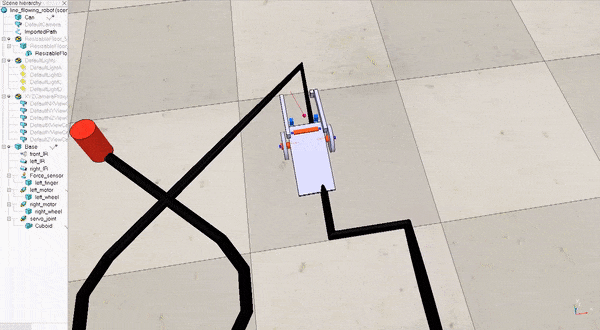

# Examples #

## Line Following Robot ##

This example shows the basic functions of the simulator. It simulates  
a line following robot controlled by an Arduino and connected as specified in the schematics document, see examples/lineFollowingRobot folder. 

### Hardware ###

The robot is a line following robot with two DC motors with wheels (left and right), which are connected to the base of the robot. The base contains two infrared sensors facing towards the ground that detect a black line on the floor. In addition, there is a IR sensor facing forwards that can be used to detect a can. A gripper at the front can grasp the can of the circuit. This gripper is controlled by a servomotor.

### Electronics ###

The robot contains a breadboard with two transistors to control the two DC motors. The 3 IR sensors are digital. The schematics of these devices and the Arduino are in the schematics folder ([here](schematics/schematic_line_following_robot.pdf)). Please, check them to know which pins of the Arduino you should use. Or use this information:

* MOTOR_RIGHT_PIN 11
* MOTOR_LEFT_PIN 10
* SENSOR_LEFT_PIN 9
* SENSOR_RIGHT_PIN 8
* SENSOR_FRONT_PIN 7
* SERVO_PIN 3

## User Interface ##

This example shows the basic functions of the user interface, see examples/userInterface folder. It simulates two potentiometers, two buttons (one momnetary push button and a latching toggle button) and a red led. This example does not need a CoppeliaSim model as there are no motors or sensors (apart from the sensors of the user interface).
The potentiometer 2 controls the intensity of the Led and prints the status of the two buttons through serial communications, see the code of the arduino sketch. 

